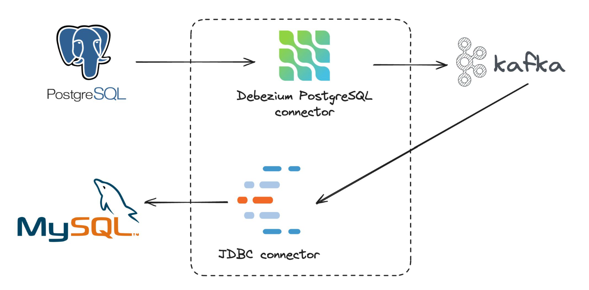

# Kafka Setup on Virtual Machine
---
# Demo 1: With `kafka-python` library on Virtal Ubuntu machine
## Quick start
```bash
brew install --cask multipass
VM_NAME="kafka-vm"
multipass launch --name "$VM_NAME" --disk 6G --mem 2.5G
multipass shell "$VM_NAME"
```
Now, switch to **Ubuntu shell**:
```bash
sudo adduser kafka # e.g: password is 1234
sudo adduser kafka sudo
su -l kafka

cd ~ && git clone https://github.com/bdbao/Kafka-VM
curl "https://downloads.apache.org/kafka/3.8.0/kafka_2.13-3.8.0.tgz" -o kafka.tgz
mkdir kafka && cd kafka
tar -xvzf ~/kafka.tgz --strip 1
cp ~/Kafka-VM/config/server.properties ./config
cp -r ~/Kafka-VM/scripts .
sudo cp ~/Kafka-VM/system/* /etc/systemd/system

# get python 3.8
sudo add-apt-repository ppa:deadsnakes/ppa
sudo apt update
sudo apt install python3.8 -y
python3.8 --version

# Create Virtual Environment
sudo apt install python3.8-venv -y
python3.8 -m venv myenv && source myenv/bin/activate
# rm -rf ~/kafka/myenv

pip install kafka-python
sudo apt install openjdk-11-jre-headless -y

sudo systemctl enable zookeeper
sudo systemctl start zookeeper
sudo systemctl enable kafka
sudo systemctl start kafka
sudo systemctl status zookeeper
sudo systemctl status kafka

python3.8 scripts/consumer.py
```
Open another terminal:
```bash
su -l kafka # pass: 1234
cd kafka && source myenv/bin/activate
python3.8 scripts/producer.py --mess "This is a message"
```
Then we can see update in the first terminal. This is **DONE**!

## Build from scratch
```bash
multipass launch --name kafka-vm --disk 6G --mem 2.5G
multipass shell kafka-vm
```
Move to Ubuntu shell
```bash
sudo adduser kafka
sudo adduser kafka sudo
su -l kafka # pass: 1234

sudo apt update
sudo apt install openjdk-11-jre-headless -y
java --version

mkdir ~/Downloads
curl "https://downloads.apache.org/kafka/3.8.0/kafka_2.13-3.8.0.tgz" -o ~/Downloads/kafka.tgz
mkdir ~/kafka && cd ~/kafka
tar -xvzf ~/Downloads/kafka.tgz --strip 1
readlink -f $(which java)
```
Modify the file `nano ~/kafka/config/server.properties`:
```
listeners=PLAINTEXT://localhost:9092 # uncomment
advertised.listeners=PLAINTEXT://localhost:9092 # uncomment, ip addr show
log.dirs=/home/kafka/logs # change dir
delete.topic.enable = true # add at EOF
```
Add to file `sudo nano /etc/systemd/system/kafka.service`:
```
[Unit]
Requires=zookeeper.service
After=zookeeper.service

[Service]
Type=simple
User=kafka
Environment="JAVA_HOME=/usr/lib/jvm/java-11-openjdk-arm64"
ExecStart=/bin/sh -c '/home/kafka/kafka/bin/kafka-server-start.sh /home/kafka/kafka/config/server.properties > /home/kafka/kafka/kafka.log 2>&1'
ExecStop=/home/kafka/kafka/bin/kafka-server-stop.sh
Restart=on-abnormal

[Install]
WantedBy=multi-user.target
```
Add to file `sudo nano /etc/systemd/system/zookeeper.service`:
```
[Unit]
Requires=network.target remote-fs.target
After=network.target remote-fs.target

[Service]
Type=simple
User=kafka
ExecStart=/home/kafka/kafka/bin/zookeeper-server-start.sh /home/kafka/kafka/config/zookeeper.properties
ExecStop=/home/kafka/kafka/bin/zookeeper-server-stop.sh
Restart=on-abnormal

[Install]
WantedBy=multi-user.target
```
```bash
sudo systemctl enable zookeeper
sudo systemctl start zookeeper
sudo systemctl status zookeeper
sudo systemctl enable kafka
sudo systemctl start kafka
sudo systemctl status kafka

# get python 3.8:
sudo add-apt-repository ppa:deadsnakes/ppa
sudo apt update
sudo apt install python3.8
python3.8 --version

# Create Virtual Environment
sudo apt install python3.8-venv
python3.8 -m venv kafkaenv && source kafkaenv/bin/activate && pip install --upgrade pip && pip install kafka-python && deactivate
# rm -rf ~/kafka/kafkaenv # delete venv
```
Open 2 terminals for these 2 commnands: 
```bash
python3.8 consumer.py
python3.8 producer.py
```

## [Optional] Another demo ([DigitalOcean](https://www.digitalocean.com/community/tutorials/how-to-install-apache-kafka-on-ubuntu-20-04)):
Something more:
```bash
# install java, mem >= 2GB
sudo apt update
sudo apt install openjdk-11-jre-headless -y
java --version

# For kafka 3.x
curl "https://downloads.apache.org/kafka/3.8.0/kafka_2.13-3.8.0.tgz" -o ~/Downloads/kafka.tgz

~/kafka/bin/kafka-topics.sh --create --bootstrap-server localhost:9092 --replication-factor 1 --partitions 1 --topic TutorialTopic
~/kafka/bin/kafka-topics.sh --delete --bootstrap-server localhost:9092 --topic TutorialTopic # delete topic
```

# Demo 2: Streamming between 2 DBMS using Kafka on Docker

## Quick start 1 (Host database on Docker)
```bash
git clone https://github.com/bdbao/Kafka-VM
cd Kafka-VM

docker compose -f database_docker/docker-compose.yml up -d
docker compose up -d

make source
make sink

mysql -h 127.0.0.1 -P 3306 -u user_kafka -p db_kafka # pass: Admin@123
  CREATE TABLE db_kafka.E00Status (id INT AUTO_INCREMENT PRIMARY KEY, status VARCHAR(50) NOT NULL, created_at TIMESTAMP DEFAULT CURRENT_TIMESTAMP);
  
psql -h localhost -U user_kafka -d db_kafka # pass: 1234
  CREATE TABLE "E00Status" (id SERIAL PRIMARY KEY, status VARCHAR(50) NOT NULL, created_at TIMESTAMP DEFAULT CURRENT_TIMESTAMP);
  INSERT INTO "E00Status" (status) VALUES ('Active'), ('Inactive'), ('Pending'), ('Completed'), ('Failed');
  INSERT INTO "E00Status" (status) VALUES ('New Status');
  UPDATE "E00Status" SET status = 'Archived' WHERE id = 2;
```
- Open: http://localhost:9000 to access the Kafka UI.\
  Open **DBeaver** for viewing databases.

```bash
make clean # delete connections on Kafka
docker compose -f database_docker/docker-compose.yml down -v
docker compose down
```
This is **DONE**!

## Quick start 2 (Host database on local)
```bash
git clone https://github.com/bdbao/Kafka-VM
cd Kafka-VM

brew install postgresql@16 # or: postgresql
brew install mysql
make startdb

psql -U postgres
  # add new user
  CREATE USER user_kafka WITH PASSWORD '1234';
  ALTER USER user_kafka WITH SUPERUSER; # (optional)
  ALTER USER user_kafka WITH REPLICATION;
  # list all users
  \du
  \q # quit

psql -h localhost -U user_kafka -d postgres
  SHOW config_file;
  # Go to file, change `wal_level = logical`, uncomment this line
  # brew services restart postgresql@16
  SHOW wal_level;

  CREATE DATABASE db_kafka;
  GRANT ALL PRIVILEGES ON DATABASE db_kafka TO user_kafka;
  \l # list all db
  
  \c db_kafka

  CREATE TABLE "E00Status" (
      id SERIAL PRIMARY KEY,
      status VARCHAR(50) NOT NULL,
      created_at TIMESTAMP DEFAULT CURRENT_TIMESTAMP
  );
  \dt # list all tables in db

mysql -u root
  CREATE USER 'user_kafka'@'localhost' IDENTIFIED BY 'Admin@123'; # (use % for any host)
  GRANT ALL ON *.* TO 'user_kafka'@'localhost' WITH GRANT OPTION;
  FLUSH PRIVILEGES; # apply changes
  SHOW GRANTS FOR 'user_kafka'@'localhost';
  # list all users
  SELECT User, Host FROM mysql.user;

  \q # quit

mysql -h localhost -P 3306 -u user_kafka -p # Pass: Admin@123
  CREATE DATABASE db_kafka;
  USE db_kafka;

  CREATE TABLE db_kafka.E00Status (id INT AUTO_INCREMENT PRIMARY KEY, status VARCHAR(50) NOT NULL, created_at TIMESTAMP DEFAULT CURRENT_TIMESTAMP);
  SHOW TABLES;

docker compose up -d
make source
make sink
```
- Open: http://localhost:9000 to access the Kafka UI.\
  Open **DBeaver** for viewing databases.

Change source database for Change Data Capture (CDC)
```sql
-- Run: psql -h localhost -U user_kafka -d db_kafka
INSERT INTO "E00Status" (status) VALUES ('Active'), ('Inactive'), ('Pending'), ('Completed'), ('Failed');
INSERT INTO "E00Status" (status) VALUES ('New Status');
UPDATE "E00Status" SET status = 'Archived' WHERE id = 2;
DELETE FROM "E00Status" WHERE id = 3; -- not capture yet
```
- (Optional) Delete user and database:
```bash
psql -U postgres
  DROP DATABASE db_kafka;
  DROP PUBLICATION dbz_publication;
  DROP USER user_kafka;
mysql -u root
  DROP DATABASE db_kafka;
  DROP USER 'user_kafka'@'localhost';
  FLUSH PRIVILEGES;
```
```bash
make clean # delete connections on Kafka
make stop
```
This is **DONE**!
## Build from scratch
```bash
cd Kafka-VM

brew install postgresql@16 # or: postgresql
brew install mysql
make startdb

docker compose up -d
```
- Open: http://localhost:9000 to access the Kafka UI and inspect the topics and messages.

To demonstrate the Debezium Postgres **source** connector and JDBC **sink** connector using your Docker Compose setup, you need to follow these steps:
1. Create PostgreSQL database-user and the PostgreSQL Source Connector:
```bash
psql -U postgres
  \l # list all db
  \c your_db # choose db
  \dt # list all tables in db

  # create db
  CREATE DATABASE db_kafka;
  
  # delete db
  SELECT pg_terminate_backend(pg_stat_activity.pid)
  FROM pg_stat_activity
  WHERE pg_stat_activity.datname = 'your_db';
  DROP DATABASE your_db;

  # list all users
  \du 

  # add new user
  CREATE USER user_kafka WITH PASSWORD '1234';
  ALTER USER user_kafka WITH SUPERUSER; # (optional)
  ALTER USER user_kafka WITH REPLICATION;
  GRANT ALL PRIVILEGES ON DATABASE db_airflow TO user_kafka;

  SELECT * FROM pg_replication_slots;
  SELECT pg_drop_replication_slot('debezium');
  
  # delete user
  SELECT pg_terminate_backend(pg_stat_activity.pid)
  FROM pg_stat_activity
  WHERE pg_stat_activity.usename = 'username_to_delete';
  DROP USER username_to_delete;

  # change password
  ALTER USER your_username WITH PASSWORD 'new_password';

  \q # quit psql postgres
```
1.1. Fix the bug: Change `wal_level` to `logical`
```bash
psql -h localhost -U user_kafka -d db_kafka # Check connection to db
  SHOW config_file;
  # Change `wal_level = logical`, uncomment this line
  # brew services restart postgresql@16
  SHOW wal_level;

  # (Optional) If create new one: delete old Replication slot, or change 'slot.name'
  SELECT * FROM pg_replication_slots;
  SELECT pg_drop_replication_slot('debezium');
  SELECT * FROM pg_replication_slots;
```
```bash
# Send the connector configuration to Kafka Connect. 
# This will create the Debezium source connector that reads changes from your PostgreSQL database and publishes them to the Kafka topic.
curl -X POST http://localhost:8083/connectors \
-H "Content-Type: application/json" \
-d '{
  "name": "debezium-postgres-connector",
  "config": {
    "connector.class": "io.debezium.connector.postgresql.PostgresConnector",
    "tasks.max": "1",
    "database.hostname": "host.docker.internal",
    "database.port": "5432",
    "database.user": "user_kafka",
    "database.password": "1234",
    "database.dbname": "db_kafka",
    "database.server.name": "source",
    "plugin.name": "pgoutput",
    "slot.name": "debezium",
    "publication.name": "dbz_publication",
    "table.include.list": "E00Status",
    "database.history.kafka.bootstrap.servers": "kafka1:29092",
    "database.history.kafka.topic": "schema-changes.sales",
    "topic.prefix": "source",
    "transforms": "route",
    "transforms.route.type": "org.apache.kafka.connect.transforms.RegexRouter",
    "transforms.route.regex": "([^.]+)\\.([^.]+)\\.([^.]+)",
    "transforms.route.replacement": "$3"
  }
}'
```
Output is like:
```
{"name":"debezium-postgres-connector","config":{"connector.class":"io.debezium.connector.postgresql.PostgresConnector","tasks.max":"1","database.hostname":"host.docker.internal","database.port":"5432","database.user":"user_kafka","database.password":"1234","database.dbname":"db_kafka","database.server.name":"source","plugin.name":"pgoutput","slot.name":"debezium","publication.name":"dbz_publication","table.include.list":"E00Status","database.history.kafka.bootstrap.servers":"kafka1:29092","database.history.kafka.topic":"schema-changes.sales","topic.prefix":"source","transforms":"route","transforms.route.type":"org.apache.kafka.connect.transforms.RegexRouter","transforms.route.regex":"([^.]+)\\.([^.]+)\\.([^.]+)","transforms.route.replacement":"$3","name":"debezium-postgres-connector"},"tasks":[],"type":"source"}%
```
- Script to **Create sample table** for Change Data Capture:
```bash
psql -h localhost -U user_kafka -d db_kafka
  CREATE TABLE "E00Status" (
      id SERIAL PRIMARY KEY,
      status VARCHAR(50) NOT NULL,
      created_at TIMESTAMP DEFAULT CURRENT_TIMESTAMP
  );

  INSERT INTO "E00Status" (status) VALUES
  ('Active'),
  ('Inactive'),
  ('Pending'),
  ('Completed'),
  ('Failed');

  INSERT INTO "E00Status" (status) VALUES ('New Status');
  UPDATE "E00Status" SET status = 'Archived' WHERE id = 2;
  DELETE FROM "E00Status" WHERE id = 3; # Not capture yet

# Check the consumer
docker exec -it kafka1 /usr/bin/kafka-console-consumer --bootstrap-server localhost:29092 --topic E00Status --from-beginning
```
Check if the connector is created and running:
```bash
curl http://localhost:8083/connectors
# Output: `["debezium-postgres-connector"]%`
```
2. Create MySQL database-user and the JDBC Sink Connector
```bash
mysql -u root
mysql -u root -p # if you’ve set a password
  # list all db
  SHOW DATABASES; 
  
  # create db
  CREATE DATABASE db_kafka;

  USE db_kafka;
  SHOW TABLES;
  SELECT * FROM table_name;

  # delete db
  DROP DATABASE db_kafka;

  # list all users
  SELECT User, Host FROM mysql.user;
  SHOW GRANTS FOR 'root'@'localhost'; # show user privileges

  # add new user
  CREATE USER 'user_kafka'@'localhost' IDENTIFIED BY 'Admin@123'; # (use % for any host)
  GRANT ALL ON *.* TO 'user_kafka'@'localhost' WITH GRANT OPTION;
  FLUSH PRIVILEGES; # apply changes
  SHOW GRANTS FOR 'user_kafka'@'%';

  # delete user
  DROP USER 'user_kafka'@'localhost';

  # change password
  ALTER USER 'username'@'host' IDENTIFIED BY 'new_password';
  FLUSH PRIVILEGES;

  \q # quit mysql

mysql --version # See the version for choosing `MySQL8Dialect`

mysql -h localhost -P 3306 -u user_kafka -p # pass: Admin@123
  CREATE TABLE db_kafka.E00Status (
      id INT AUTO_INCREMENT PRIMARY KEY,
      status VARCHAR(50) NOT NULL,
      created_at TIMESTAMP DEFAULT CURRENT_TIMESTAMP
  );

  (DELETE FROM db_kafka.E00Status WHERE id=3;)
```

2.1. Fix the bug: ***org.hibernate.exception.GenericJDBCException: Unable to acquire JDBC Connection [Connections could not be acquired from the underlying database!]***
- Add **MySQL JDBC Driver** to Kafka in Docker\
Download: [Here](https://downloads.mysql.com/archives/get/p/3/file/mysql-connector-j-8.0.31.zip)
```bash
# docker volume create kafka-jdbc
# docker run --rm -v kafka-jdbc:/jdbc busybox mkdir /jdbc/lib
# docker cp ./mysql-connector-j-8.0.31/mysql-connector-j-8.0.31.jar $(docker create --rm -v kafka-jdbc:/jdbc busybox):/jdbc/lib/
docker cp ./mysql-connector-j-8.0.31/mysql-connector-j-8.0.31.jar debezium:/jdbc/lib/
docker exec -it debezium ls /jdbc/lib # check file .jar exists
```
- Update `docker-compose.yml` as in [here](https://github.com/bdbao/Kafka-VM/blob/27555ef1c7caf88a8c8330e7f49b12b444445bec/docker-compose.yml) (in comment part).
```bash
docker-compose down
docker-compose up -d
```
```bash
# Send the sink connector configuration
# topic: {table_name}
curl -X POST http://localhost:8083/connectors \
-H "Content-Type: application/json" \
-d '{
  "name": "jdbc-sink-connector",
  "config": {
    "connector.class": "io.debezium.connector.jdbc.JdbcSinkConnector",
    "tasks.max": "1",
    "topics": "E00Status",
    "connection.url": "jdbc:mysql://host.docker.internal:3306/db_kafka",
    "connection.username": "user_kafka",
    "connection.password": "Admin@123",
    "auto.create": "true",
    "auto.evolve": "true",
    "insert.mode": "upsert",
    "primary.key.fields": "id",
    "primary.key.mode": "record_key",
    "schema.evolution": "basic",
    "transforms": "unwrap",
    "transforms.unwrap.type": "io.debezium.transforms.ExtractNewRecordState",
    "key.converter": "org.apache.kafka.connect.json.JsonConverter",
    "key.converter.schemas.enable": "true",
    "value.converter": "org.apache.kafka.connect.json.JsonConverter",
    "value.converter.schemas.enable": "true",
    "hibernate.dialect": "org.hibernate.dialect.MySQL8Dialect"
  }
}'
```
Output is like:
```
{"name":"jdbc-sink-connector","config":{"connector.class":"io.debezium.connector.jdbc.JdbcSinkConnector","tasks.max":"1","topics":"source.E00Status","connection.url":"jdbc:mysql://host.docker.internal:3306/db_kafka","connection.username":"user_kafka","connection.password":"Admin@123","auto.create":"true","auto.evolve":"true","insert.mode":"upsert","primary.key.fields":"id","primary.key.mode":"record_key","schema.evolution":"basic","transforms":"unwrap","transforms.unwrap.type":"io.debezium.transforms.ExtractNewRecordState","key.converter":"org.apache.kafka.connect.json.JsonConverter","key.converter.schemas.enable":"true","value.converter":"org.apache.kafka.connect.json.JsonConverter","value.converter.schemas.enable":"true","hibernate.dialect":"org.hibernate.dialect.MySQL8Dialect","name":"jdbc-sink-connector"},"tasks":[],"type":"sink"}%
```
Check the status of the JDBC connector:
```bash
curl http://localhost:8083/connectors/
# Output: `["debezium-postgres-connector","jdbc-sink-connector"]%`
```

2.2. Fix the bug: ***org.apache.kafka.connect.errors.ConnectException: Exiting WorkerSinkTask due to unrecoverable exception. at org.apache.kafka.connect.runtime.WorkerSinkTask.deliverMessages(WorkerSinkTask.java:635) at***
```bash
# Check consumer can catch the change or not

docker exec -it debezium ls /kafka/connect/debezium-connector-jdbc | grep "mysql"
docker cp ./mysql-connector-j-8.0.31/mysql-connector-j-8.0.31.jar debezium:/kafka/connect/debezium-connector-jdbc/mysql-connector-java-8.0.31.jar
docker exec -it debezium rm -rdf /kafka/connect/debezium-connector-jdbc/mysql-connector-j-9.0.0.jar

docker logs debezium > log_debezium.txt
```
2.3. Fix the bug (in `log_debezium.txt`): ***org.apache.kafka.connect.errors.ConnectException: Failed to process a sink record. Caused by: java.lang.NullPointerException: Cannot invoke "org.apache.kafka.connect.data.Schema.name()" because the return value of "org.apache.kafka.connect.sink.SinkRecord.valueSchema()" is null***
```bash
make clean

curl -X POST http://localhost:8083/connectors \
-H "Content-Type: application/json" \
-d '{
  "name": "debezium-postgres-connector",
  "config": {
    "connector.class": "io.debezium.connector.postgresql.PostgresConnector",
    "tasks.max": "1",
    "database.hostname": "host.docker.internal",
    "database.port": "5432",
    "database.user": "user_kafka",
    "database.password": "1234",
    "database.dbname": "db_kafka",
    "database.server.name": "source",
    "plugin.name": "pgoutput",
    "slot.name": "debezium",
    "publication.name": "dbz_publication",
    "table.include.list": "public.E00Status",
    "database.history.kafka.bootstrap.servers": "kafka1:29092",
    "database.history.kafka.topic": "schema-changes.sales",
    "topic.prefix": "source",
    "transforms": "route",
    "transforms.route.type": "org.apache.kafka.connect.transforms.RegexRouter",
    "transforms.route.regex": "([^.]+)\\.([^.]+)\\.([^.]+)",
    "transforms.route.replacement": "$3",
    "key.converter": "org.apache.kafka.connect.json.JsonConverter",
    "key.converter.schemas.enable": "true",
    "value.converter": "org.apache.kafka.connect.json.JsonConverter",
    "value.converter.schemas.enable": "true"
  }
}'

curl -X POST http://localhost:8083/connectors \
-H "Content-Type: application/json" \
-d '{
  "name": "jdbc-sink-connector",
  "config": {
    "connector.class": "io.debezium.connector.jdbc.JdbcSinkConnector",
    "tasks.max": "1",
    "topics": "E00Status",
    "connection.url": "jdbc:mysql://host.docker.internal:3306/db_kafka",
    "connection.username": "user_kafka",
    "connection.password": "Admin@123",
    "auto.create": "true",
    "auto.evolve": "true",
    "insert.mode": "upsert",
    "primary.key.fields": "id",
    "primary.key.mode": "record_key",
    "schema.evolution": "basic",
    "transforms": "unwrap",
    "transforms.unwrap.type": "io.debezium.transforms.ExtractNewRecordState",
    "key.converter": "org.apache.kafka.connect.json.JsonConverter",
    "key.converter.schemas.enable": "true",
    "value.converter": "org.apache.kafka.connect.json.JsonConverter",
    "value.converter.schemas.enable": "true",
    "errors.log.enable": "true",
    "errors.log.include.messages": "true",
    "errors.tolerance": "all"
  }
}'
```

3. Verify Data Flow (DBeaver for viewing)
   - PostgreSQL to Kafka: To test the data flow, modify a record in the PostgreSQL source database (insert, update, or delete). The Debezium source connector should capture the change and publish it to the Kafka topic.
   - Kafka to MySQL: The JDBC sink connector will pick up this change and apply it to your MySQL destination.
   - **Fix DBeaver** for MySQL: "Public Key Retrieval is not allowed":
     + Right-click your connection, choose "Edit Connection"
      + On the "Connection settings" screen (main screen), click on "Driver properties"
      + Set these two properties: "allowPublicKeyRetrieval" to true and "useSSL" to false

For troubleshooting: `docker logs debezium`

# Some notes:
- Host DB on local machine / different container:
  - Call db_server from local machine, use: `localhost`
  - Call db_server from Docker container: `host.docker.internal`
- Host DB on the same container (in same file **docker-compose.yml**) like **demo-3**:
  - Call db_server from local machine, still use: `localhost`
  - Call db_server from that Docker container: `localhost` or ***service-name***
- Some other resource:
  - [MySQL to PostgreSQL, demo-3](https://blog.devgenius.io/change-data-capture-from-mysql-to-postgresql-using-kafka-connect-and-debezium-ae8740ef3a1d)
  - [MySQL to MySQL](https://medium.com/@alexander.murylev/kafka-connect-debezium-mysql-source-sink-replication-pipeline-fb4d7e9df790)
  - [Dezebium doc for PostgreSQL](https://debezium.io/documentation/reference/stable/connectors/postgresql.html)
