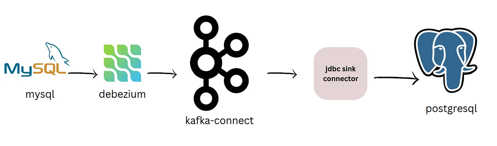

# Demo 3: Change Data Capture from MySQL to PostgreSQL using Kafka connect and Debezium


Link: [CDC from MySQL to PostgreSQL](https://blog.devgenius.io/change-data-capture-from-mysql-to-postgresql-using-kafka-connect-and-debezium-ae8740ef3a1d)

```bash
cd Kafka-VM
docker compose -f demo3/docker-compose.yml up -d
(docker compose -f demo3/docker-compose.yml down)

docker exec -it demo3-connect-1 ls /kafka/libs
docker cp "demo3/confluentinc-kafka-connect-jdbc-10.8.0/lib/." demo3-connect-1:/kafka/libs
docker restart demo3-connect-1

# Open http://localhost:8083/connector-plugins

curl -i -X POST -H "Accept:application/json" -H  "Content-Type:application/json" http://localhost:8083/connectors/ -d @demo3/scripts/source.json
curl -i -X POST -H "Accept:application/json" -H  "Content-Type:application/json" http://localhost:8083/connectors/ -d @demo3/scripts/sink.json

curl -X GET http://localhost:8083/connectors/inventory-connector/status
curl -X GET http://localhost:8083/connectors/jdbc-sink/status

curl -X DELETE http://localhost:8083/connectors/inventory-connector
curl -X DELETE http://localhost:8083/connectors/jdbc-sink

# Open http://localhost:8083/connectors

# For source db MySQL:
docker exec -it demo3-mysql-1 bash
  mysql -h mysql -P 3306 -u debezium -p  # pass:dbz
    show databases;
    use inventory;
    show tables;
    select * from customers;

# Check topic list, has `customers`
docker exec -it demo3-kafka-1 /kafka/bin/kafka-topics.sh --list --bootstrap-server kafka:9092

# For destination db PostgreSQL:
docker exec -it demo3-postgres-1 bash
  psql -h postgres -p 5432 -U postgresuser -d inventory # pass: postgrespw
  \dt
  select id, first_name, last_name, email from public.customers;
```
